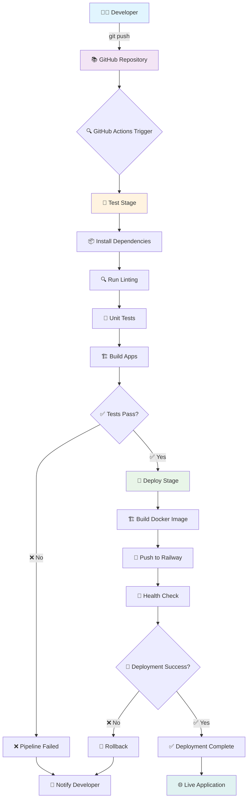

A full-stack web application that allows users to compare different AI models (OpenAI GPT, Anthropic Claude, Google Gemini, etc.) by sending the same prompt to multiple models and analyzing their responses, token usage, and costs.

## 🎯 Project Summary

This application helps developers and AI enthusiasts:
- **Compare AI Models**: Send the same prompt to multiple AI providers simultaneously
- **Track Usage & Costs**: Monitor token consumption and associated costs across different models
- **Manage API Keys**: Securely store and manage API keys for various AI providers
- **Analyze Performance**: View detailed comparisons of response quality, speed, and efficiency
- **User Management**: Secure authentication with Google OAuth and traditional email/password

### Key Features
- 🔐 **Authentication**: Google OAuth + Email/Password login
- 🤖 **Multi-Provider Support**: OpenAI, Anthropic, Google Gemini, Cohere
- 📊 **Usage Analytics**: Token tracking, cost analysis, response time metrics
- 🔑 **API Key Management**: Secure storage and management of provider API keys
- 📱 **Modern UI**: Beautiful interface built with HeroUI components and real-time comparisons
- 💾 **Data Persistence**: Save comparison history and export results

## 🏗️ Architecture Overview

This application follows **Domain-Driven Design (DDD)** principles to ensure maintainable, scalable code organization.

### High-Level Architecture

```
┌─────────────────┐    ┌─────────────────┐    ┌─────────────────┐
│   React Web     │    │  Express.js     │    │   PostgreSQL    │
│   Frontend      │◄──►│   Backend       │◄──►│   Database      │
│  (Port: 4200)   │    │  (Port: 3333)   │    │                 │
└─────────────────┘    └─────────────────┘    └─────────────────┘
                              │
                              ▼
                    ┌─────────────────┐
                    │  External APIs  │
                    │ • OpenAI        │
                    │ • Anthropic     │
                    │ • Google        │ 
                    └─────────────────┘
```

### Domain-Driven Design Structure

Our application is organized around these core **domains**:

#### 🔐 **Authentication Domain**
- Handles user registration, login, and session management
- Manages Google OAuth integration
- JWT token generation and validation

#### 🤖 **AI Provider Domain** 
- Integrates with different AI APIs (OpenAI, Anthropic, etc.)
- Handles token counting and cost calculations
- Manages rate limiting and error handling

#### 🔑 **API Key Management Domain**
- Securely stores and encrypts user API keys
- Validates and tests API key functionality
- Manages key rotation and access control

#### 📊 **Comparison Domain**
- Orchestrates multi-model comparisons
- Aggregates results and metrics
- Handles comparison history and analytics

#### 👤 **User Domain**
- Manages user profiles and preferences
- Tracks usage statistics and quotas
- Handles user settings and dashboard data

## 📁 Project Structure (NX Monorepo)

```
model-comparator/
│
├── 📱 apps/                          # Application layer
│   ├── web/                          # React Frontend Application
│   │   ├── src/
│   │   │   ├── app/
│   │   │   │   ├── components/       # UI Components
│   │   │   │   ├── pages/           # Page Components
│   │   │   │   ├── hooks/           # Custom React Hooks
│   │   │   │   └── stores/          # State Management
│   │   │   ├── assets/              # Static Assets
│   │   │   └── main.tsx             # App Entry Point
│   │   └── project.json
│   │
│   └── api/                          # Express.js Backend Application
│       ├── src/
│       │   ├── domains/             # DDD Domain Logic
│       │   │   ├── auth/            # Authentication Domain
│       │   │   ├── ai-providers/    # AI Provider Domain
│       │   │   ├── api-keys/        # API Key Management Domain
│       │   │   ├── comparisons/     # Comparison Domain
│       │   │   └── users/           # User Domain
│       │   ├── infrastructure/      # External Dependencies
│       │   │   ├── database/        # Database Configuration
│       │   │   ├── external-apis/   # Third-party API clients
│       │   │   └── security/        # Security utilities
│       │   ├── presentation/        # API Layer
│       │   │   ├── routes/          # Express Routes
│       │   │   ├── middleware/      # Custom Middleware
│       │   │   └── validators/      # Request Validation
│       │   └── main.ts              # Server Entry Point
│       └── project.json
│
├── 📚 libs/                          # Shared Libraries
│   ├── design-system/                # React Component Library
│   │   ├── src/
│   │   │   ├── components/
│   │   │   │   ├── FormField.tsx
│   │   │   │   ├── PasswordField.tsx
│   │   │   │   └── SocialButton.tsx
│   │   │   ├── styles/              # SCSS Styles
│   │   │   └── index.ts             # Library Entry Point
│   │   └── project.json
│   │
│   └── shared/                       # Shared Types & Interfaces
│       ├── src/
│       │   ├── types/
│       │   │   └── auth.types.ts
│       │   └── index.ts             # Library Entry Point
│       └── project.json
│
├── 🐳 Infrastructure Files
│   ├── Dockerfile                    # Container Configuration
│   ├── nginx.conf                   # Nginx Reverse Proxy Config
│   ├── railway.toml                 # Railway Deployment Config
│   └── start.sh                     # Container Startup Script
│
├── 🔄 CI/CD Configuration
│   └── .github/workflows/
│       └── deploy.yml               # GitHub Actions Pipeline
│
├── 📋 Configuration Files
│   ├── nx.json                      # NX Workspace Configuration
│   ├── tsconfig.base.json           # TypeScript Base Configuration
│   ├── package.json                 # Dependencies & Scripts
│   └── README.md                    # This file
└── 📝 Documentation
    ├── docs/
    │   ├── api/                     # API Documentation
    │   ├── deployment/              # Deployment Guides
    │   └── development/             # Development Setup
    └── .env.example                 # Environment Variables Template
```

## 🔄 CI/CD Pipeline Overview

Our continuous integration and deployment pipeline ensures code quality and automated deployments:



### Pipeline Stages Explained

#### 🧪 **Test Stage** (Runs on every push/PR)
1. **Install Dependencies**: Download all required npm packages
2. **Linting**: Check code style and potential issues with ESLint
3. **Unit Tests**: Run all unit tests for both frontend and backend
4. **Build Verification**: Ensure both apps can be built successfully

#### 🚀 **Deploy Stage** (Runs only on main branch)
1. **Docker Build**: Create production-ready container image
2. **Railway Deploy**: Push image to Railway platform
3. **Health Check**: Verify application is running correctly
4. **Success/Rollback**: Complete deployment or revert on failure

#### 📊 **Quality Gates**
- ✅ All tests must pass (>= 80% coverage)
- ✅ No linting errors
- ✅ Successful build for both apps
- ✅ Security vulnerability checks
- ✅ Performance benchmarks

## 🛠️ Tech Stack

### Frontend (React)
- **Framework**: React 18 with TypeScript
- **UI Library**: HeroUI (Modern React component library)
- **State Management**: React Context + useReducer  
- **Routing**: React Router v6
- **HTTP Client**: Axios
- **Charts**: Recharts for usage analytics
- **Icons**: Lucide React (included with HeroUI)

### Using the Design System
Our `design-system` library provides reusable React components that are shared across the web application.

#### Importing Components
To use a component, import it directly from the library's entry point:
```typescript
import { FormField, PasswordField, SocialButton } from '@model-comparator/design-system';
```

#### Available Components
- `FormField`: A standard text input field with a label.
- `PasswordField`: A password input field with a show/hide toggle.
- `SocialButton`: A button for social logins (e.g., Google, GitHub).

# AI Model Comparison App

### Backend (Node.js)
- **Framework**: Express.js with TypeScript
- **Database**: PostgreSQL with node-postgres
- **Authentication**: JWT + Passport.js (Google OAuth)
- **Validation**: Joi for request validation
- **Security**: Helmet, CORS, bcrypt for password hashing
- **API Documentation**: OpenAPI/Swagger

### Infrastructure
- **Hosting**: Railway (Full-stack deployment)
- **Database**: Railway PostgreSQL
- **CI/CD**: GitHub Actions
- **Containerization**: Docker
- **Reverse Proxy**: Nginx

## 🚀 Getting Started

### Prerequisites
- Node.js 18+ and npm
- Git
- Railway CLI (for deployment)

### Initial Setup
```bash
# Clone the repository
git clone <repository-url>
cd ai-model-compare

# Install dependencies
npm install

# Set up environment variables
cp .env.example .env
# Edit .env with your API keys and configuration

# Start development servers
npm run dev
```

### Development Commands
```bash
# Start both frontend and backend
npm run dev

# Run tests
npm run test

# Build for production
npm run build

# Deploy to Railway
npm run deploy
```

## 🔐 Environment Variables

Create a `.env` file with the following variables:

```env
# Database
DATABASE_URL=postgresql://...

# Authentication
JWT_SECRET=your-secret-key
GOOGLE_CLIENT_ID=your-google-client-id
GOOGLE_CLIENT_SECRET=your-google-client-secret

# AI Provider APIs
OPENAI_API_KEY=sk-...
ANTHROPIC_API_KEY=sk-ant-...
GOOGLE_API_KEY=AI...
COHERE_API_KEY=...
```

## 📚 Domain-Driven Design Explanation

For junior developers new to DDD, here's what each domain represents:

### 🎯 **Domain** = Business Area
Think of each domain as a specific area of our business logic. Each domain:
- Has its own set of rules and responsibilities
- Contains related functionality grouped together  
- Can be developed and tested independently
- Has clear boundaries with other domains

### 🏗️ **How Domains Work Together**
```
User wants to compare AI models
         ↓
1. Authentication Domain → Verify user is logged in
2. API Key Domain → Get user's stored API keys  
3. AI Provider Domain → Call external APIs
4. Comparison Domain → Process and save results
5. User Domain → Update usage statistics
```

### 📁 **Domain Structure Pattern**
Each domain follows this consistent pattern:
```
domain-name/
├── entities/          # Core business objects
├── services/          # Business logic
├── repositories/      # Data access
└── types/            # Domain-specific types
```

This organization makes the codebase:
- **Easier to understand**: Related code is grouped together
- **Easier to test**: Each domain can be tested in isolation
- **Easier to maintain**: Changes in one domain don't break others
- **Easier to scale**: New features can be added as new domains

## 🤝 Contributing

1. Fork the repository
2. Create a feature branch (`git checkout -b feature/amazing-feature`)
3. Commit your changes (`git commit -m 'Add amazing feature'`)
4. Push to the branch (`git push origin feature/amazing-feature`)
5. Open a Pull Request

## 📄 License

This project is licensed under the MIT License - see the [LICENSE](LICENSE) file for details.
